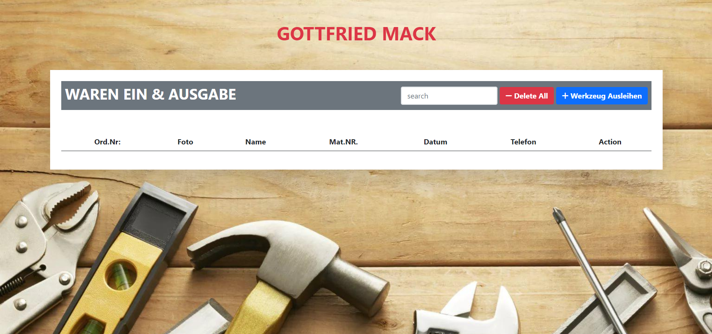

Warenausgabe ist ein Tool, das den Prozess der Aufnahme und Ausgabe von Waren in einem Lager oder einer Lagerstätte automatisiert und überwacht. 
Es ermöglicht die Erfassung von Artikelinformationen, Mengen, Lagerorte und Bewegungen sowie die Verfolgung des Lagerbestands in Echtzeit. 
Mit einem Lagerverwaltungssystem können Lagermitarbeiter effizient Waren empfangen, lagern, kommissionieren und versenden, was zu einer verbesserten Lagerverwaltung und einem reibungsloseren Betrieb führt.

